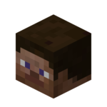

# Chunkchat

### What is this?
A Spigot plugin that connects the Minecraft in-game chat and a GroupMe group. 
- Display player chat, join/leave messages, and death messages in GroupMe. 
- Send messages from GroupMe back to in-game chat. 
- Customize what messages are displayed in GroupMe.

### Why use this plugin?
- Create a feeling of community and interaction between players, even when few players are on the server at one time.
- Foster cooperation between players in different cities, timezones, or schedules.
- As an admin, monitor your server chat activity quickly via phone.

### Who should use Minecraft-GroupMe?
- Groups of friends running their own private server
- Any server with a low concurrent player count that wants to improve the general "community" feeling
- Admins looking to manage a secondary chat channel that interacts with the Minecraft chat

### Example Screenshots
")

# Requirements
Minecraft-GroupMe is designed for Spigot 1.14.4, and has not been tested on any earlier versions.

# Getting Started
There are three steps to setup the plugin:
1. Install the plugin on your server
2. Configure the plugin server port in the config
1. Register a GroupMe bot account and add the credentials to the config

## 1. Installing Minecraft-GroupMe
Download the latest .jar from the release branch, and add it to your server /plugins folder. Restart the server, and a default configuration file will be generated.

## 2. Configure the Plugin Server Port
In order for GroupMe to send messages to the server, Minecraft-GroupMe runs a small server that waits for messages. The server port must be set to a port number that is publically accessible and not used by any other plugin.

Many server hosts specify a port you can use for plugins like this, for example server.pro's control panel lists:

> Open Ports: Plugins or mods that require ports can be set to use any port between 1024 and 65535.

in the configuration file, set the port, for example: `port: 1025`

## 3. Configure the GroupMe Bot.

1. Log into the GroupMe developer portal: https://dev.groupme.com/
2. Click "Create Bot" to create a new bot integration.
3. Choose the group the bot will send/receive messages in. 
4. Give the bot a name, for example _"MC"_.
5. For the Callback Url, enter the server IP and port with _http://_ protocol, for example: _http://127.0.0.1:1024_
6. For the Avatar URL, set an image URL. An example image is provided on this repository (`images/steve.png`) but you will need to upload the image at a hosting service somewhere to set the avatar.
7. Submit, and copy "Bot ID". Add this ID to the configuration, for example: `groupme_bot_id: a1b2c3d4e5f6g7h8`

Reload the plugin and you should be ready! Try sending a message in GroupMe, and verify it shows up in Minecraft. Then, try sending a message in Minecraft, and verify it shows in GroupMe. 

If you have trouble, open a Github issue!

# Configuration Options

- `groupme_bot_id`: _String_, the GroupMe Bot ID.
- `server_port`: _Integer_, the server port that Minecraft-GroupMe will listen for GroupMe messages on.
- `messages_join_leave`: _Boolean (true/false)_, Whether join/leave messages will be sent to GroupMe.
- `messages_death`: _Boolean (true/false)_, whether death messages will be sent to GroupMe.
- `messages_chat`: _Boolean (true/false)_, whether chat messages will be sent to GroupMe.
